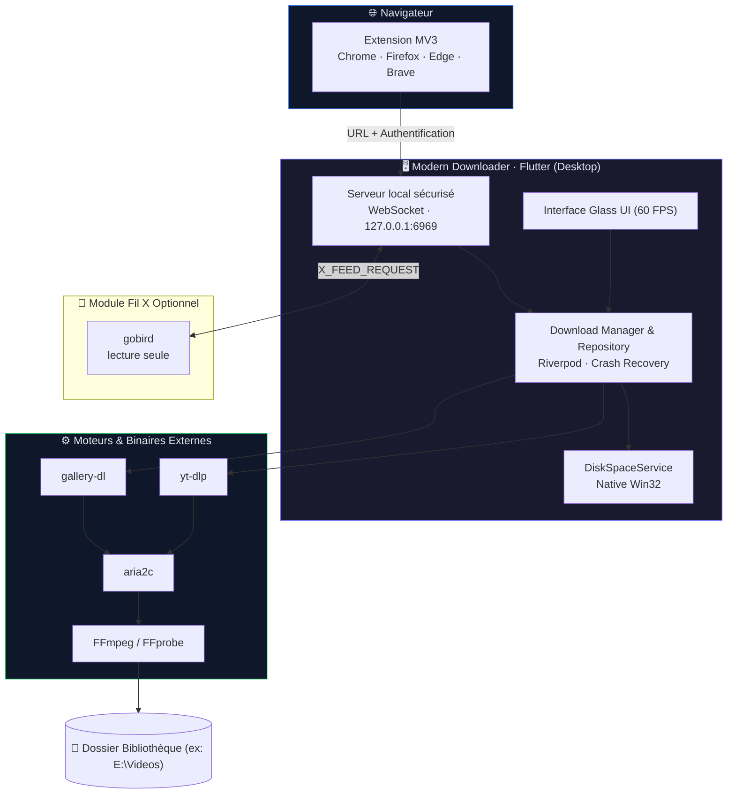

<div align="center">


# Modern Downloader

**Téléchargeur de médias moderne, fluide et privé pour Windows et Android**  
*Modern, high-performance, privacy-first media downloader & library manager*

<br />

[](https://github.com/itsnazzym/Downloader/actions/workflows/ci.yml)
[](https://github.com/itsnazzym/Downloader/releases)
[](LICENSE)
[](https://github.com/itsnazzym/Downloader/releases)
[](https://flutter.dev)

[Téléchargements / Releases](https://github.com/itsnazzym/Downloader/releases) · [Extensions](#extensions-navigateur--browser-extensions) · [Confidentialité](extension/privacy.md)

</div>

---

## 🌟 Fonctionnalités Clés / Key Features

| Fonctionnalité | Description |
|---|---|
| **1000+ plateformes** | Téléchargement universel vidéo, audio & galeries via `yt-dlp` et `gallery-dl`. |
| **Vitesse Maximale** | Téléchargement multi-connexions accéléré par **aria2c** et conversion/remuxage sans perte avec **FFmpeg**. |
| **File d'attente Intelligente** | Gestion stricte de la concurrence (`maxConcurrent` personnalisable), rotation automatique et statut `En attente` fluide. |
| **Tri Bidirectionnel Interactif** | Classement instantané par **Date**, **Nom (A-Z)** et **Taille** avec flèches ascendante/descendante (⬆️ / ⬇️) toggleables en 1 clic. |
| **Performance 60 FPS Anti-Freeze** | Architecture non bloquante, vérification d'espace disque Win32 native ultra-rapide et pagination optimisée pour des milliers de vidéos. |
| **Extensions Navigateur MV3** | Capture en 1 clic depuis Chrome, Firefox, Edge et Brave via WebSocket local sécurisé (`127.0.0.1:6969`). |
| **Respect de la vie privée** | Zéro télémétrie, cookies gérés localement, support Tor SOCKS5 et stockage local 100% autonome. |
| **Interface Glassmorphism** | Design sombre premium, prévisualisation vidéo intégrée, barre d'état dynamique et inspecteur de détails. |

---

## 🏗️ Architecture



<details>
<summary><strong>📁 Structure détaillée du projet</strong></summary>

```
lib/
├── core/
│   ├── download/      # Algorithmes de file d'attente, reprise après crash, arguments
│   ├── logger/        # Système de journalisation local
│   ├── providers/     # Paramètres globaux, thèmes, état du système
│   ├── services/      # Espace disque Win32, serveur WebSocket, notifications
│   ├── theme/         # Design Glassmorphism, tokens de couleurs
│   └── ui/            # Vues de paramètres, composants d'interface partagés
├── features/
│   ├── downloader/    # Gestion des téléchargements (domain, data, presentation)
│   └── x_feed/        # Analyseur et lecteur de flux X / Twitter
└── l10n/              # Fichiers de localisation (FR, EN, AR)
extension/
├── shared/            # Code source JavaScript commun Manifest V3
├── chrome/            # Package prêt pour Chrome / Edge / Brave
└── firefox/           # Package prêt pour Firefox
installer/             # Script Inno Setup (mise à jour directe sans doublons)
tool/                  # Scripts d'automatisation de build et packaging
```

</details>

---

## 🚀 Démarrage Rapide / Quick Start

### 📥 Utilisateur — Installation

1. Téléchargez la dernière version depuis la page **[Releases](https://github.com/itsnazzym/Downloader/releases)** :
   - **Windows — Installeur (`ModernDownloader-Setup-vX.Y.Z.exe`)** : Installe ou met à jour l'application directement à son emplacement existant.
   - **Windows — Version Portable (`ModernDownloader-Windows-Portable.zip`)** : Décompressez et lancez sans installation.
   - **Android — APK (`ModernDownloader-Android-vX.Y.Z.apk`)** : sideload (GitHub Releases). Partagez une vidéo depuis X/Twitter/YouTube/TikTok vers Modern Downloader, ou ouvrez l'onglet **Parcourir X** pour le bouton overlay sur chaque vidéo.
2. Lancez l'application. Les moteurs d'extraction (`yt-dlp`, `FFmpeg`, `aria2c`) sont inclus ou initialisés automatiquement.
3. *(Optionnel, Windows)* Installez l'[extension de navigateur](#extensions-navigateur--browser-extensions) pour capturer les médias en un clic.

### Android — capture sans copier-coller

| Contexte | Gestes |
|---|---|
| App Twitter/X, YouTube, TikTok… | **Partager → Modern Downloader** (téléchargement immédiat) |
| Onglet **Parcourir X** dans l'app | Bouton **Download** overlay sur chaque vidéo (1 tap) |
| Kiwi Browser + extension MV3 | Même overlay que sur Windows, via `127.0.0.1` |

Les fichiers sont enregistrés dans `Download/ModernDownloader/`.

Le moteur Android s'appuie sur [youtubedl-android](https://github.com/yausername/youtubedl-android) (yt-dlp + FFmpeg + aria2c embarqués). L'APK combiné est donc soumis à la GPL-3.0 de cette bibliothèque.

Compilation Android :

```bash
flutter pub get
flutter build apk --release
```

---

### 💻 Développeur — Compilation depuis les sources

**Prérequis :** Windows 10/11 · [Flutter SDK](https://docs.flutter.dev/get-started/install/windows) stable · Git · Python 3.10+

```bash
# 1. Cloner le dépôt
git clone https://github.com/itsnazzym/Downloader.git
cd Downloader

# 2. Récupérer les dépendances
flutter pub get

# 3. Lancer en mode développement
flutter run -d windows

# 4. Compiler la version Release Windows
flutter build windows --release

# 5. Créer l'installeur Setup et le ZIP Portable
python tool/package_release.py
```

---

## 🧩 Extensions Navigateur / Browser Extensions

Les extensions **Manifest V3** détectent les vidéos/médias sur l'onglet actif et les transmettent instantanément à l'application via WebSocket (`127.0.0.1:6969`).

### Installation manuelle développeur :

- **Chrome / Edge / Brave :**
  1. Ouvrez `chrome://extensions` (ou `edge://extensions`).
  2. Activez le **Mode développeur** (en haut à droite).
  3. Cliquez sur **Charger l'extension non empaquetée** et sélectionnez le dossier `extension/chrome/`.
- **Firefox :**
  1. Ouvrez `about:debugging` → **Ce Firefox**.
  2. Cliquez sur **Charger un module complémentaire temporaire...** et sélectionnez `extension/firefox/manifest.json`.

---

## 🧪 Module Fil X & gobird (Optionnel)

Le module **Fil X** permet de prévisualiser et télécharger des flux vidéo depuis X / Twitter :
- **Mode DOM local (par défaut)** : Collecte les vidéos chargées dans l'onglet actif du navigateur en temps réel.
- **Mode gobird (expérimental)** : Extraction directe en lecture seule (bornée à 10 000 tweets) activable volontairement dans les *Réglages avancés*.

---

## 🛠️ Commandes Utiles & Tests

| Commande | Description |
|---|---|
| `flutter test` | Exécute la suite complète de 286+ tests unitaires |
| `dart analyze` | Analyse statique et vérification de conformité du code Dart |
| `dart run tool/build_extension.dart` | Compile et synchronise les extensions Chrome et Firefox |
| `flutter build windows --release` | Génère l'exécutable Windows optimisé |
| `python tool/package_release.py` | Package le setup Inno Setup et l'archive ZIP portable |

---

## 🤝 Contribution

1. Forkez le projet.
2. Créez une branche de fonctionnalité (`git checkout -b feature/ma-fonctionnalite`).
3. Vérifiez la conformité du code : `dart analyze && flutter test`.
4. Committez vos modifications (`git commit -m 'feat: description de la fonctionnalite'`).
5. Poussez sur votre branche (`git push origin feature/ma-fonctionnalite`) et ouvrez une **Pull Request**.

---

<div align="center">

**Modern Downloader** · Conçu pour la vitesse, la fluidité et la vie privée.  
*Open Source · MIT License*

</div>
