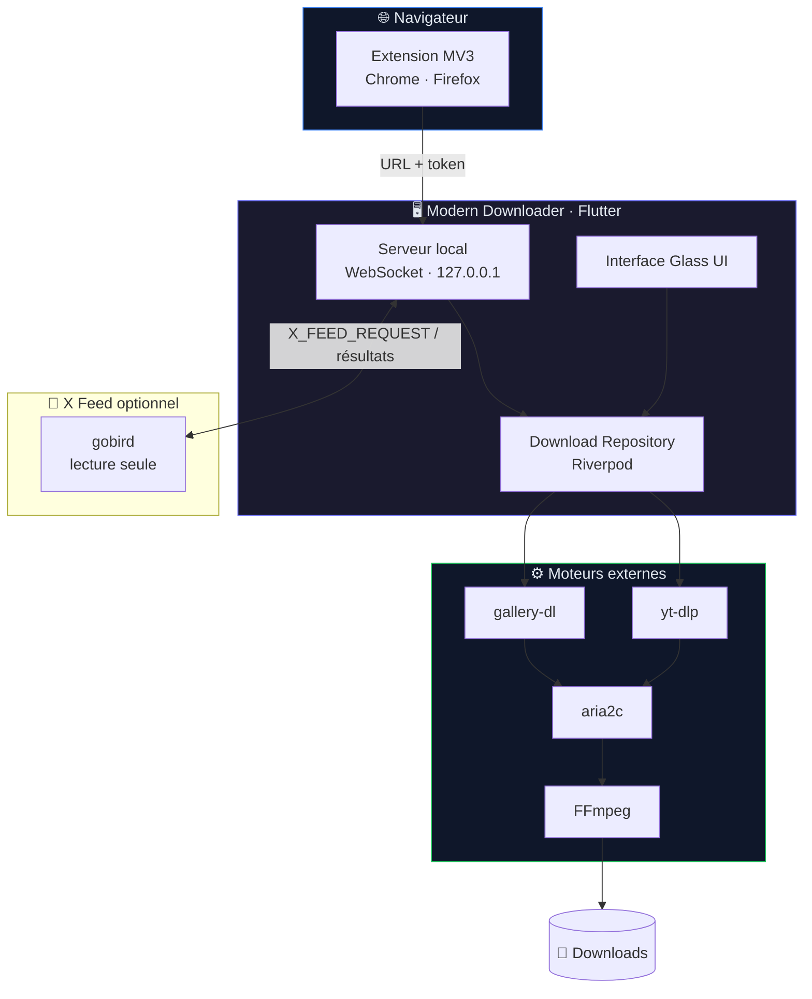

<div align="center">


# Modern Downloader

**Téléchargeur de médias moderne pour Windows** · *Modern, privacy-first media downloader*

<br />

[](https://github.com/Mizaruta/Downloader/actions/workflows/ci.yml)
[](https://github.com/Mizaruta/Downloader/releases)
[](LICENSE)
[](https://github.com/Mizaruta/Downloader/releases)
[](https://flutter.dev)

[Releases](https://github.com/Mizaruta/Downloader/releases) · [Extensions](#extensions-navigateur--browser-extensions) · [Privacy](extension/privacy.md)

</div>

---

## Pourquoi ? / Why?

| | |
|---|---|
| **1000+ sites** | Vidéos, audio & galeries via `yt-dlp` + `gallery-dl` |
| **Rapide** | Multi-thread avec **aria2c**, conversion **FFmpeg** |
| **Privé** | Tor SOCKS5, cookies locaux, zéro télémétrie |
| **UI premium** | Glassmorphism, thèmes, lecteur intégré, 60 fps |

> Remplace la ligne de commande par une app de bureau native + extensions Chrome & Firefox.

---

## Architecture



<details>
<summary><strong>Structure du projet</strong></summary>

```
lib/
├── core/           # UI, thème, services (WebSocket, notifications)
├── features/       # Downloader + X Feed (domain / data / presentation)
└── l10n/           # FR · EN · AR
extension/
├── shared/         # Sources communes MV3
├── chrome/         # Build Chrome / Edge / Brave
└── firefox/        # Build Firefox
third_party/gobird/ # Licence et avertissement d'utilisation
tool/               # Builds, signature Firefox et préparation gobird
installer/          # Inno Setup (releases)
```

</details>

---

## Démarrage rapide / Quick Start

### Utilisateur — Télécharger la release

1. Téléchargez **[ModernDownloader-Windows-Portable.zip](https://github.com/Mizaruta/Downloader/releases/latest)** ou l'installateur `.exe`
2. Lancez l'app → les dépendances (`yt-dlp`, `FFmpeg`, `aria2c`) s'installent au premier démarrage
3. *(Optionnel)* Installez l'[extension navigateur](#extensions-navigateur--browser-extensions)

### Développeur — Build from source

**Prérequis :** Windows 10/11 · [Flutter SDK](https://docs.flutter.dev/get-started/install/windows) stable · Git

```bash
git clone https://github.com/Mizaruta/Downloader.git
cd Downloader
flutter pub get
flutter run -d windows          # dev
flutter build windows --release # release → build/windows/x64/runner/Release/
```

---

## Extensions navigateur / Browser Extensions

Les extensions **Manifest V3** envoient l'onglet courant à l'application via un
WebSocket local authentifié sur `127.0.0.1`.

### Build et installation développeur

Depuis la racine du dépôt :

```bash
dart run tool/build_extension.dart
```

- **Chrome / Edge / Brave :** ouvrir `chrome://extensions`, activer le mode
  développeur, puis charger le dossier `extension/chrome/`.
- **Firefox :** ouvrir `about:debugging` → **Ce Firefox** → **Charger un module
  complémentaire temporaire…**, puis sélectionner
  `extension/firefox/manifest.json`.
- Dans le popup, renseigner le jeton API de l'application, vérifier le port
  `6969`, puis cliquer sur **Tester la connexion**.

Le module Firefox temporaire disparaît au redémarrage du navigateur. Pour une
installation persistante, utiliser `modern_downloader_firefox.xpi` depuis
[Releases](https://github.com/Mizaruta/Downloader/releases).

### Publication Firefox (AMO unlisted, automatique en CI)

Le job **release** de [`.github/workflows/ci.yml`](.github/workflows/ci.yml)
signe `modern_downloader_firefox.xpi` via
[web-ext](https://extensionworkshop.com/documentation/develop/getting-started-with-web-ext/)
et le publie sur GitHub Releases.

**Secrets GitHub requis** (Settings → Secrets and variables → Actions) :

| Secret | Valeur |
|--------|--------|
| `AMO_JWT_ISSUER` | Émetteur du JWT (page [Gérer les clés d'API](https://addons.mozilla.org/developers/addon/api/key/)) |
| `AMO_JWT_SECRET` | Secret JWT (affiché une seule fois à la création) |

Après ajout des secrets, chaque push sur `main` ou `master` produit un XPI
**signé Mozilla** (canal unlisted). La première soumission peut exiger une
validation AMO ; les mises à jour suivantes avec le même `gecko.id` passent en
général automatiquement.

**Sécurité :** ne commitez jamais le secret JWT. Si une clé a été exposée (capture d'écran, chat), révoquez-la sur AMO et régénérez-en une avant de la mettre dans GitHub Secrets.

---

## Fil X et gobird expérimental

Le panneau **Fil X** collecte les vidéos déjà rendues dans l'onglet X actif.
La collecte DOM locale reste le comportement par défaut. Les éléments uniques
restent dans la liste pendant la session (limite de sécurité : 10 000 éléments)
et le défilement de X reste contrôlé par l'utilisateur.

### Activer gobird sous Windows

gobird est désactivé par défaut. Il utilise les API privées non officielles de
X et peut entraîner une limitation ou une suspension du compte. L'activation
est volontaire et nécessite l'acceptation du risque dans **Réglages avancés**.
Voir [`third_party/gobird/RISK_NOTICE.md`](third_party/gobird/RISK_NOTICE.md).

1. Lancer Modern Downloader.
2. Dans **Réglages avancés**, activer **Utiliser gobird (expérimental)**.
3. Laisser **Cookies auto** activé dans le popup de l'extension.
4. Ouvrir `https://x.com/home` dans le même Firefox ou Chrome et rester
   connecté.
5. Ouvrir **Fil X**. Le panneau lance gobird automatiquement ; **Analyser**
   permet de relancer la requête.

Sur Windows, l'extension envoie un heartbeat local Netscape des cookies X.
L'application n'extrait que `auth_token` et `ct0`, puis les transmet au
processus gobird via son environnement. Les cookies ne sont pas inclus dans
`X_FEED_REQUEST` et ne sont jamais placés dans les arguments de commande.
Seule la commande de lecture `home` bornée à 10000 tweets (500 pages max) est autorisée.

Le binaire épinglé est gobird `26.05.13`. Pour le préparer localement :

```powershell
.\tool\prepare_gobird.ps1 -SkipDownloadIfPresent
```

Le binaire local `bin/gobird.exe` est volontairement ignoré par Git. La CI le
télécharge, vérifie son SHA-256 et l'inclut dans les artefacts Windows.

### Sources et fallback

- **gobird expérimental** : la requête distante locale a réussi.
- **Repli local (gobird a échoué)** : gobird a échoué ; le message du panneau
  indique la cause.
- **Pour vous — local** : le panneau utilise la collecte DOM locale.

Le fil d'accueil gobird demande jusqu'à 10000 tweets par requête (`--count`,
`--max-pages 500`) et conserve au plus 10000 vidéos. Le panneau de l'extension
limite l'affichage via un curseur et peut sélectionner les N premières
vidéos dans l'ordre affiché. Quand gobird réussit, le
panneau fusionne l'instantané avec la collecte DOM en temps réel, qui reste
active. La collecte DOM ne peut voir que les vidéos rendues par la
virtualisation de X.

---

## Stack technique

| Couche | Technologie |
|--------|-------------|
| App | Flutter · Dart 3.10+ · Riverpod · GoRouter |
| Extraction | yt-dlp · gallery-dl |
| Téléchargement | aria2c |
| Conversion | FFmpeg |
| Desktop | window_manager · tray_manager · media_kit |
| Extension | MV3 · WebSocket localhost |

---

## Scripts utiles

| Commande | Description |
|----------|-------------|
| `flutter pub get` | Installer les dépendances |
| `flutter analyze` | Analyse statique |
| `flutter test` | Tests unitaires |
| `flutter build windows --release` | Build release Windows |
| `dart run tool/build_extension.dart` | Regénérer les extensions |
| `.\tool\prepare_gobird.ps1 -SkipDownloadIfPresent` | Vérifier et préparer gobird Windows |
| `.\tool\sign_firefox_xpi.ps1` | Signer le XPI Firefox localement (nécessite `AMO_JWT_*`) |

Les releases sont automatiques à chaque **push** sur `main` ou `master` :
bump `+0.0.1`, commit `chore(release): vX.Y.Z`, tag et publication (ZIP
portable, installateur, XPI Firefox, ZIP Chrome).

---

## Hygiène du dépôt

Les sources, tests, scripts et avis de licence sont versionnés. Les sorties
locales ou générées sont ignorées pour éviter de polluer les commits :

- `build/`, `.dart_tool/`, fichiers IDE, caches, logs et fichiers `.env` ;
- `bin/` pour les binaires téléchargés comme `gobird.exe` ;
- `signed-xpi/` et les packages de release locaux (`.zip`, `.exe`, `.xpi`,
  `.msi` à la racine).

Les dossiers `extension/shared/`, `extension/chrome/` et
`extension/firefox/` restent disponibles pour le développement et les
installations temporaires. Après une modification de `extension/shared/`,
relancer `dart run tool/build_extension.dart`.

---

## Contribuer / Contributing

1. Fork → branche `feature/ma-feature`
2. `flutter analyze && flutter test`
3. Pull Request

---

<div align="center">

**Mizaruta / Downloader** · 2023–2026

</div>
